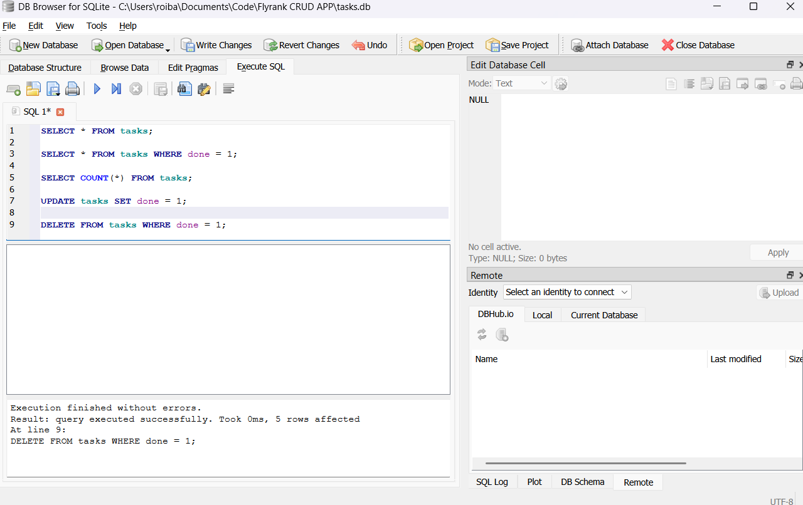

# Task API

A simple CRUD REST API for managing tasks, built with Express and documented with Swagger UI.

## Install & Run

```bash
npm install && node index.js
```

The server starts on `http://localhost:3000`. Open `http://localhost:3000/docs` for interactive API documentation.

## Endpoints

| Method   | Endpoint        | Description                    | Body                        |
|----------|-----------------|--------------------------------|-----------------------------|
| GET      | /tasks          | List all tasks                 | —                           |
| GET      | /tasks/:id      | Get a task by ID               | —                           |
| POST     | /tasks          | Create a new task              | `{ "title": "string" }`     |
| PUT      | /tasks/:id      | Update a task's title or done  | `{ "title", "done" }`       |
| DELETE   | /tasks/:id      | Delete a task                  | —                           |

## Example Response

```
$ curl -i http://localhost:3000/tasks/1

HTTP/1.1 200 OK
Content-Type: application/json

{"id":1,"title":"Finish the task","done":false}
```

## Swagger UI


## Database

### Why SQLite?

SQLite was chosen because it is:

- **Zero configuration** — no database server to install, run, or manage.
- **File-based** — the whole database lives in a single file, easy to back up and share.
- **Embedded** — the app talks to it directly through `better-sqlite3`, so there are no network round-trips.
- **Perfect for a small CRUD API** — it handles everything this project needs while staying simple.

### Where the database is stored

The database file is `tasks.db` in the project root. It is created automatically the first time the app starts:

- `CREATE TABLE IF NOT EXISTS tasks ...` ensures the `tasks` table exists (`index.js`).
- If the table is empty on startup, three sample tasks are inserted so the API has data to show.

So someone cloning the repository only needs to run `npm install && node index.js` — the database is created for them automatically.

### Database viewer

The screenshot below shows the database open in the SQLite viewer, running an example query:



### Example SQL query

Show only the tasks that are already completed:

```sql
SELECT * FROM tasks WHERE done = 1;
```

Result:

| id | title           | done |
|----|-----------------|------|
| 3  | Complete week 1 | 1    |
