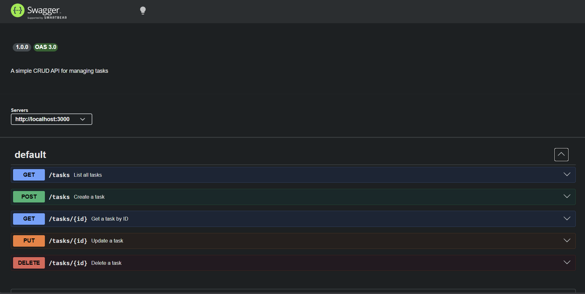

# Task API

A simple CRUD REST API for managing tasks, built with Express and documented with Swagger UI.

## Install & Run

```bash
npm install && node index.js
```

The server starts on `http://localhost:3000`. Open `http://localhost:3000/docs` for interactive API documentation.

## Endpoints

| Method   | Endpoint        | Description                    | Body                        |
|----------|-----------------|--------------------------------|-----------------------------|
| GET      | /tasks          | List all tasks                 | —                           |
| GET      | /tasks/:id      | Get a task by ID               | —                           |
| POST     | /tasks          | Create a new task              | `{ "title": "string" }`     |
| PUT      | /tasks/:id      | Update a task's title or done  | `{ "title", "done" }`       |
| DELETE   | /tasks/:id      | Delete a task                  | —                           |

## Example Response

```
$ curl -i http://localhost:3000/tasks/1

HTTP/1.1 200 OK
Content-Type: application/json

{"id":1,"title":"Finish the task","done":false}
```

## Swagger UI


