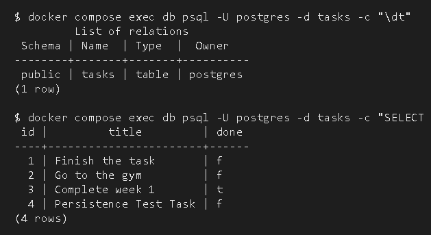

# Task API

A containerized RESTful CRUD API for managing tasks, built with Node.js, Express, and PostgreSQL, documented with Swagger UI, and orchestrated with Docker Compose.

---

## What This Is

This service provides a lightweight task management backend. It allows clients to create, read, update, and delete tasks. The application is completely containerized, isolating both the Express application server and the PostgreSQL database into decoupled containers connected via a private Docker bridge network.

---

## Quick Start (One Command)

To run the entire application stack without manual database installation or manual SQL setup:

1. **Clone the repository and prepare environment configuration:**

   ```bash
   cp .env.example .env
   ```

2. **Start the stack:**

   ```bash
   docker compose up -d
   ```

**Verify:** The API server will automatically initialize the database schema, apply initial task seeds, and start accepting requests on `http://localhost:3000`. Interactive Swagger UI documentation is available at `http://localhost:3000/docs`.

### Environment Variables

All configuration settings are managed through environment variables defined in `.env` (refer to `.env.example` for defaults):

| Variable            | Description                                                       | Default / Example Value                    |
|---------------------|-------------------------------------------------------------------|--------------------------------------------|
| `DATABASE_URL`      | Full PostgreSQL connection string used by Node.js                 | `postgres://postgres:dev@db:5432/tasks`    |
| `POSTGRES_PASSWORD` | Password for the `postgres` user inside the DB container          | `dev`                                      |
| `POSTGRES_DB`       | Database name created on container initialization                 | `tasks`                                    |

**Security Note:** Never commit `.env` to version control. The `.gitignore` file explicitly excludes `.env` to prevent credential leakage.

### API Endpoints

| Method   | Endpoint     | Description                         | Request Body                        | Success         | Error          |
|----------|--------------|-------------------------------------|-------------------------------------|-----------------|----------------|
| GET      | `/tasks`     | Retrieve all tasks                  | None                                | `200 OK`        | `500`          |
| GET      | `/tasks/:id` | Get a specific task by ID           | None                                | `200 OK`        | `404`, `500`   |
| POST     | `/tasks`     | Create a new task                   | `{ "title": "string" }`             | `201 Created`   | `400`, `500`   |
| PUT      | `/tasks/:id` | Update title and/or completion status | `{ "title"?: "string", "done"?: boolean }` | `200 OK` | `400`, `404`, `500` |
| DELETE   | `/tasks/:id` | Delete a task by ID                 | None                                | `204 No Content`| `404`, `500`   |

### Example Request & Response

Retrieve all tasks:

```bash
$ curl -s http://localhost:3000/tasks
```

```json
[{"id":1,"title":"Finish the task","done":false},{"id":2,"title":"Go to the gym","done":false},{"id":3,"title":"Complete week 1","done":true},{"id":4,"title":"Persistence Test Task","done":false}]
```

Retrieve a single task with full HTTP response headers:

```bash
$ curl -i http://localhost:3000/tasks/1
```

```
HTTP/1.1 200 OK
X-Powered-By: Express
Content-Type: application/json; charset=utf-8
Content-Length: 47
ETag: W/"2f-RH4XxN3jETdukyfOLAar2qevMRk"
Date: Tue, 11 Aug 2026 13:33:18 GMT
Connection: keep-alive
Keep-Alive: timeout=5

{"id":1,"title":"Finish the task","done":false}
```

### Swagger UI

Interactive API documentation and endpoint testing are built into the Express application:

---

## Architecture & Database Design

### Why PostgreSQL & Docker Compose?

The database architecture was designed around containerized PostgreSQL rather than local SQLite or host-managed DBs:

- **Zero Host Dependencies:** Anyone with Docker installed can run the exact same stack regardless of OS. No local PostgreSQL installation is required on the host machine.
- **Service Isolation:** The Node API (`api`) and PostgreSQL database (`db`) run in separate containers. They communicate securely across Docker's internal DNS network using the hostname `db`.
- **Data Persistence via Docker Volumes:** Database files live in a dedicated named volume (`taskdata`). Even if containers are stopped or removed (`docker compose down`), all created tasks survive intact.
- **Automatic Schema Initialization:** On initial container boot, SQL migration scripts create the `tasks` table and automatically seed sample data if empty.

### Database Inspection & Verification

You can inspect the database structure and raw data using either the Docker CLI or a graphical database client.

**Option A: Via Docker CLI (psql)**

Run interactive SQL commands inside the running database container:

```bash
docker compose exec db psql -U postgres -d tasks -c "\dt"
```

```bash
docker compose exec db psql -U postgres -d tasks -c "SELECT * FROM tasks;"
```

Example output:

```
         List of relations
 Schema | Name  | Type  |  Owner   
--------+-------+-------+----------
 public | tasks | table | postgres 
(1 row)

 id |         title         | done 
----+-----------------------+------
  1 | Finish the task       | f
  2 | Go to the gym         | f
  3 | Complete week 1       | t
  4 | Persistence Test Task | f
(4 rows)
```

Here is a screenshot of the database running live inside Docker:



**Option B: Via GUI Client (DBeaver / TablePlus / pgAdmin)**

To connect an external GUI tool:

| Setting   | Value                                          |
|-----------|------------------------------------------------|
| Host      | `localhost`                                    |
| Port      | `5432` (if exposed) or inspect via `docker compose exec` |
| Database  | `tasks`                                        |
| Username  | `postgres`                                     |
| Password  | `dev`                                          |
